# APEX Dependency Graph

**Autonomous Production Engineering Executor**

Complete dependency graph with cycle detection, topological sort, and build order derivation.

---

## Node Definitions

All files to generate, keyed by unique identifier.

### Level 0: Contracts (Immutable Ground Truth)

| ID | File | Type | Dependencies |
|----|------|------|--------------|
| `C0` | `contracts/inference_api.yaml` | OpenAPI 3.0 | — |
| `C1` | `contracts/intelligence_api.yaml` | OpenAPI 3.0 | — |
| `C2` | `contracts/models/hardware_profile.py` | Pydantic | — |
| `C3` | `contracts/models/model_config.py` | Pydantic | — |
| `C4` | `contracts/models/index_entry.py` | Pydantic | — |
| `C5` | `contracts/models/context_request.py` | Pydantic | — |
| `C6` | `contracts/models/completion_request.py` | Pydantic | — |
| `C7` | `contracts/models/editor_adapter.py` | Pydantic | — |

### Level 1: Stage 1 Base + Stage 2 Base + Stage 3 Base

| ID | File | Stage | Dependencies |
|----|------|-------|--------------|
| `S1-A` | `stage1/hardware_scanner.py` | Stage 1 | `C2` |
| `S2-A` | `stage2/ast_indexer.py` | Stage 2 | `C4` |
| `S2-B` | `stage2/embedder.py` | Stage 2 | `C0`, `C3` |
| `S3-A` | `stage3/adapter_interface.py` | Stage 3 | `C1`, `C7` |

### Level 2: Stage 1 Model + Stage 2 Graph + Stage 3 Extension

| ID | File | Stage | Dependencies |
|----|------|-------|--------------|
| `S1-B` | `stage1/model_selector.py` | Stage 1 | `C2`, `C3`, `S1-A` |
| `S2-C` | `stage2/call_graph.py` | Stage 2 | `C4`, `S2-A` |
| `S2-D` | `stage2/embedding_index.py` | Stage 2 | `C4`, `S2-B` |
| `S3-B` | `stage3/vscodium/extension.ts` | Stage 3 | `C1`, `S3-A` |

### Level 3: Stage 1 Manager + Stage 2 Context + Stage 3 Features

| ID | File | Stage | Dependencies |
|----|------|-------|--------------|
| `S1-C` | `stage1/llama_server_manager.py` | Stage 1 | `C2`, `C3`, `S1-B` |
| `S1-D` | `stage1/vram_monitor.py` | Stage 1 | `C2` |
| `S2-E` | `stage2/context_packager.py` | Stage 2 | `C4`, `C5`, `S2-C`, `S2-D` |
| `S2-F` | `stage2/file_watcher.py` | Stage 2 | `C4`, `S2-A`, `S2-D` |
| `S2-G` | `stage2/search.py` | Stage 2 | `C5` |
| `S3-C` | `stage3/vscodium/completion.ts` | Stage 3 | `C1`, `C6`, `S3-B` |
| `S3-D` | `stage3/vscodium/hover.ts` | Stage 3 | `C1`, `C5`, `S3-B` |
| `S3-E` | `stage3/vscodium/status_bar.ts` | Stage 3 | `C1`, `S3-B` |

### Level 4: Stage 1 Proxy + Stage 2 Server + Stage 3 Config

| ID | File | Stage | Dependencies |
|----|------|-------|--------------|
| `S1-E` | `stage1/inference_proxy.py` | Stage 1 | `C0`, `C2`, `S1-C`, `S1-D` |
| `S2-H` | `stage2/intelligence_server.py` | Stage 2 | `C1`, `C4`, `C5`, `C6`, `S2-E`, `S2-F`, `S2-G` |
| `S3-F` | `stage3/vscodium/package.json` | Stage 3 | `S3-B`, `S3-C`, `S3-D`, `S3-E` |
| `S3-G` | `stage3/vscodium/refactor.ts` | Stage 3 | `C1`, `C5`, `S3-B` |
| `S3-H` | `stage3/vscodium/intelligence_client.ts` | Stage 3 | `C1`, `C5`, `C6` |

### Level 5: Entry Points

| ID | File | Stage | Dependencies |
|----|------|-------|--------------|
| `S1-F` | `stage1/main.py` | Stage 1 | `C0`, `C2`, `C3`, `S1-A`, `S1-B`, `S1-C`, `S1-D`, `S1-E` |
| `S2-I` | `stage2/main.py` | Stage 2 | `C1`, `C4`, `C5`, `S2-A`, `S2-B`, `S2-C`, `S2-D`, `S2-E`, `S2-F`, `S2-G`, `S2-H` |

### Level 6: Tests

| ID | File | Type | Dependencies |
|----|------|------|--------------|
| `T0` | `tests/test_stage_isolation.py` | Isolation | All stage files |
| `T1-A` | `tests/stage1/test_hardware_scanner.py` | Stage 1 | `S1-A`, `C2` |
| `T1-B` | `tests/stage1/test_model_selector.py` | Stage 1 | `S1-B`, `C2`, `C3` |
| `T1-C` | `tests/stage1/test_server_manager.py` | Stage 1 | `S1-C`, `C2`, `C3` |
| `T1-D` | `tests/stage1/test_inference_api.py` | Stage 1 | `S1-E`, `C0` |
| `T2-A` | `tests/stage2/test_ast_indexer.py` | Stage 2 | `S2-A`, `C4` |
| `T2-B` | `tests/stage2/test_call_graph.py` | Stage 2 | `S2-C`, `C4` |
| `T2-C` | `tests/stage2/test_context_packager.py` | Stage 2 | `S2-E`, `C4`, `C5` |
| `T2-D` | `tests/stage2/test_intelligence_api.py` | Stage 2 | `S2-H`, `C1` |
| `T3-A` | `tests/stage3/test_adapter_interface.py` | Stage 3 | `S3-A`, `C1`, `C7` |
| `T3-B` | `tests/stage3/test_isolation.py` | Stage 3 | `S3-B`, `S3-C`, `S3-D`, `S3-E`, `S3-G`, `S3-H` |
| `T4` | `tests/integration/test_full_pipeline.py` | Integration | All stages live |

### Level 7: Configuration

| ID | File | Type | Dependencies |
|----|------|------|--------------|
| `CFG-A` | `shared/ports.py` | Config | — |
| `CFG-B` | `stage1/requirements.txt` | Config | `S1-A`, `S1-B`, `S1-C`, `S1-D`, `S1-E`, `S1-F` |
| `CFG-C` | `stage2/requirements.txt` | Config | `S2-A`, `S2-B`, `S2-C`, `S2-D`, `S2-E`, `S2-F`, `S2-G`, `S2-H`, `S2-I` |
| `CFG-D` | `stage3/vscodium/tsconfig.json` | Config | `S3-B`, `S3-C`, `S3-D`, `S3-E`, `S3-F`, `S3-G`, `S3-H` |
| `CFG-E` | `.vscode/settings.json` | Config | All stages |
| `CFG-F` | `.vscode/extensions.json` | Config | `S3-F` |
| `CFG-G` | `.vscode/launch.json` | Config | `S1-F`, `S2-I` |
| `CFG-H` | `.vscode/tasks.json` | Config | All stages |
| `CFG-I` | `apex.code-workspace` | Config | `CFG-E`, `CFG-F`, `CFG-G`, `CFG-H` |
| `CFG-J` | `docker-compose.yml` | Config | `S1-F`, `S2-I`, `CFG-B`, `CFG-C` |
| `CFG-K` | `docker-compose.prod.yml` | Config | `S1-F`, `S2-I`, `CFG-B`, `CFG-C` |
| `CFG-L` | `.env.example` | Config | `CFG-J`, `CFG-K` |
| `CFG-M` | `tasks.md` | Config | All |
| `CFG-N` | `README.md` | Config | All |

---

## Dependency Graph (Edge List)

```
# Level 0 (no dependencies)
C0 → ∅
C1 → ∅
C2 → ∅
C3 → ∅
C4 → ∅
C5 → ∅
C6 → ∅
C7 → ∅

# Level 1
S1-A → {C2}
S2-A → {C4}
S2-B → {C0, C3}
S3-A → {C1, C7}

# Level 2
S1-B → {C2, C3, S1-A}
S2-C → {C4, S2-A}
S2-D → {C4, S2-B}
S3-B → {C1, S3-A}

# Level 3
S1-C → {C2, C3, S1-B}
S1-D → {C2}
S2-E → {C4, C5, S2-C, S2-D}
S2-F → {C4, S2-A, S2-D}
S2-G → {C5}
S3-C → {C1, C6, S3-B}
S3-D → {C1, C5, S3-B}
S3-E → {C1, S3-B}

# Level 4
S1-E → {C0, C2, S1-C, S1-D}
S2-H → {C1, C4, C5, C6, S2-E, S2-F, S2-G}
S3-F → {S3-B, S3-C, S3-D, S3-E}
S3-G → {C1, C5, S3-B}
S3-H → {C1, C5, C6}

# Level 5
S1-F → {C0, C2, C3, S1-A, S1-B, S1-C, S1-D, S1-E}
S2-I → {C1, C4, C5, S2-A, S2-B, S2-C, S2-D, S2-E, S2-F, S2-G, S2-H}

# Level 6 (Tests)
T0 → {S1-A, S1-B, S1-C, S1-D, S1-E, S1-F, S2-A, S2-B, S2-C, S2-D, S2-E, S2-F, S2-G, S2-H, S2-I, S3-A, S3-B, S3-C, S3-D, S3-E, S3-F, S3-G, S3-H}
T1-A → {S1-A, C2}
T1-B → {S1-B, C2, C3}
T1-C → {S1-C, C2, C3}
T1-D → {S1-E, C0}
T2-A → {S2-A, C4}
T2-B → {S2-C, C4}
T2-C → {S2-E, C4, C5}
T2-D → {S2-H, C1}
T3-A → {S3-A, C1, C7}
T3-B → {S3-B, S3-C, S3-D, S3-E, S3-G, S3-H}
T4 → {S1-F, S2-I, S3-B}

# Level 7 (Configuration)
CFG-A → ∅
CFG-B → {S1-A, S1-B, S1-C, S1-D, S1-E, S1-F}
CFG-C → {S2-A, S2-B, S2-C, S2-D, S2-E, S2-F, S2-G, S2-H, S2-I}
CFG-D → {S3-B, S3-C, S3-D, S3-E, S3-F, S3-G, S3-H}
CFG-E → {S1-F, S2-I, S3-F}
CFG-F → {S3-F}
CFG-G → {S1-F, S2-I}
CFG-H → {S1-F, S2-I, S3-F}
CFG-I → {CFG-E, CFG-F, CFG-G, CFG-H}
CFG-J → {S1-F, S2-I, CFG-B, CFG-C}
CFG-K → {S1-F, S2-I, CFG-B, CFG-C}
CFG-L → {CFG-J, CFG-K}
CFG-M → {All}
CFG-N → {All}
```

---

## Graph Visualization (Mermaid)

```mermaid
graph TD
    subgraph Level0[LEVEL 0: Contracts]
        C0[C0: inference_api.yaml]
        C1[C1: intelligence_api.yaml]
        C2[C2: hardware_profile.py]
        C3[C3: model_config.py]
        C4[C4: index_entry.py]
        C5[C5: context_request.py]
        C6[C6: completion_request.py]
        C7[C7: editor_adapter.py]
    end

    subgraph Level1[LEVEL 1: Base Components]
        S1A[S1-A: hardware_scanner.py]
        S2A[S2-A: ast_indexer.py]
        S2B[S2-B: embedder.py]
        S3A[S3-A: adapter_interface.py]
    end

    subgraph Level2[LEVEL 2: Model + Graph + Extension]
        S1B[S1-B: model_selector.py]
        S2C[S2-C: call_graph.py]
        S2D[S2-D: embedding_index.py]
        S3B[S3-B: extension.ts]
    end

    subgraph Level3[LEVEL 3: Manager + Context + Features]
        S1C[S1-C: llama_server_manager.py]
        S1D[S1-D: vram_monitor.py]
        S2E[S2-E: context_packager.py]
        S2F[S2-F: file_watcher.py]
        S2G[S2-G: search.py]
        S3C[S3-C: completion.ts]
        S3D[S3-D: hover.ts]
        S3E[S3-E: status_bar.ts]
    end

    subgraph Level4[LEVEL 4: Proxy + Server + Config]
        S1E[S1-E: inference_proxy.py]
        S2H[S2-H: intelligence_server.py]
        S3F[S3-F: package.json]
        S3G[S3-G: refactor.ts]
        S3H[S3-H: intelligence_client.ts]
    end

    subgraph Level5[LEVEL 5: Entry Points]
        S1F[S1-F: stage1/main.py]
        S2I[S2-I: stage2/main.py]
    end

    %% Level 0 edges (none - roots)

    %% Level 1 edges
    S1A --> C2
    S2A --> C4
    S2B --> C0
    S2B --> C3
    S3A --> C1
    S3A --> C7

    %% Level 2 edges
    S1B --> C2
    S1B --> C3
    S1B --> S1A
    S2C --> C4
    S2C --> S2A
    S2D --> C4
    S2D --> S2B
    S3B --> C1
    S3B --> S3A

    %% Level 3 edges
    S1C --> C2
    S1C --> C3
    S1C --> S1B
    S1D --> C2
    S2E --> C4
    S2E --> C5
    S2E --> S2C
    S2E --> S2D
    S2F --> C4
    S2F --> S2A
    S2F --> S2D
    S2G --> C5
    S3C --> C1
    S3C --> C6
    S3C --> S3B
    S3D --> C1
    S3D --> C5
    S3D --> S3B
    S3E --> C1
    S3E --> S3B

    %% Level 4 edges
    S1E --> C0
    S1E --> C2
    S1E --> S1C
    S1E --> S1D
    S2H --> C1
    S2H --> C4
    S2H --> C5
    S2H --> C6
    S2H --> S2E
    S2H --> S2F
    S2H --> S2G
    S3F --> S3B
    S3F --> S3C
    S3F --> S3D
    S3F --> S3E
    S3G --> C1
    S3G --> C5
    S3G --> S3B
    S3H --> C1
    S3H --> C5
    S3H --> C6

    %% Level 5 edges
    S1F --> C0
    S1F --> C2
    S1F --> C3
    S1F --> S1A
    S1F --> S1B
    S1F --> S1C
    S1F --> S1D
    S1F --> S1E
    S2I --> C1
    S2I --> C4
    S2I --> C5
    S2I --> S2A
    S2I --> S2B
    S2I --> S2C
    S2I --> S2D
    S2I --> S2E
    S2I --> S2F
    S2I --> S2G
    S2I --> S2H
```



---

## Cycle Detection

### Algorithm: DFS-based Back Edge Detection

```
visited = set()
rec_stack = set()
back_edges = []

def dfs(node):
    visited.add(node)
    rec_stack.add(node)
    
    for neighbor in dependencies[node]:
        if neighbor not in visited:
            dfs(neighbor)
        elif neighbor in rec_stack:
            back_edges.append((node, neighbor))
    
    rec_stack.remove(node)
```

### Cycle Detection Results

| Check | Result |
|-------|--------|
| Stage 1 → contracts only (no S2, no S3) | ✓ No back edges |
| Stage 2 → contracts + Stage 1 API only | ✓ No back edges |
| Stage 3 → contracts + Stage 2 API only | ✓ No back edges |
| Cross-stage imports (grep enforcement) | ✓ No back edges |
| Full graph DFS | ✓ No back edges |

**Conclusion**: Graph is a **Directed Acyclic Graph (DAG)**. Proceed to topological sort.

---

## Topological Sort (Kahn's Algorithm)

### Algorithm

```
in_degree = {node: count(deps) for node, deps in graph}
queue = [node for node in in_degree if in_degree[node] == 0]
levels = []

while queue:
    level = sorted(queue)  # alphabetical for determinism
    levels.append(level)
    queue = []
    
    for node in level:
        for dependent in dependents[node]:
            in_degree[dependent] -= 1
            if in_degree[dependent] == 0:
                queue.append(dependent)
```

### Sorted Levels

| Level | Nodes | Count |
|-------|-------|-------|
| 0 | `C0`, `C1`, `C2`, `C3`, `C4`, `C5`, `C6`, `C7`, `CFG-A` | 9 |
| 1 | `S1-A`, `S2-A`, `S2-B`, `S3-A`, `S3-H` | 5 |
| 2 | `S1-B`, `S1-D`, `S2-C`, `S2-D`, `S2-G`, `S3-B` | 6 |
| 3 | `S1-C`, `S2-E`, `S2-F`, `S3-C`, `S3-D`, `S3-E`, `S3-G` | 7 |
| 4 | `S1-E`, `S2-H`, `S3-F` | 3 |
| 5 | `S1-F`, `S2-I` | 2 |
| 6 | `T1-A`, `T1-B`, `T1-C`, `T1-D`, `T2-A`, `T2-B`, `T2-C`, `T2-D`, `T3-A`, `T3-B`, `T0` | 11 |
| 7 | `T4` | 1 |
| 8 | `CFG-B`, `CFG-C`, `CFG-D`, `CFG-E`, `CFG-F`, `CFG-G`, `CFG-H` | 7 |
| 9 | `CFG-I`, `CFG-J`, `CFG-K`, `CFG-L`, `CFG-M`, `CFG-N` | 6 |

---

## Derived Build Plan

### Phase 1: Contracts (Level 0)

```
Generate in parallel:
  ├── contracts/inference_api.yaml
  ├── contracts/intelligence_api.yaml
  ├── contracts/models/hardware_profile.py
  ├── contracts/models/model_config.py
  ├── contracts/models/index_entry.py
  ├── contracts/models/context_request.py
  ├── contracts/models/completion_request.py
  ├── contracts/models/editor_adapter.py
  └── shared/ports.py

Gate: GATE-1 (Contract Validation)
  ├── openapi-spec-validator inference_api.yaml
  ├── openapi-spec-validator intelligence_api.yaml
  ├── mypy contracts/models/*.py
  └── pytest tests/test_stage_isolation.py (import checks)
```

### Phase 2: Base Components (Level 1)

```
Generate in parallel:
  ├── stage1/hardware_scanner.py
  ├── stage2/ast_indexer.py
  ├── stage2/embedder.py
  ├── stage3/adapter_interface.py
  └── stage3/vscodium/intelligence_client.ts

Gate: GATE-2
  ├── PASS 1: SYNTAX (ast.parse, tsc --noEmit)
  ├── PASS 2: CONTRACT (signature matching)
  ├── PASS 3: COMPLETENESS (no TODO/NotImplemented)
  └── PASS 4: LOGIC (VRAM math, HTTP client typing)
```

### Phase 3: Model + Graph + Extension (Level 2)

```
Generate in parallel:
  ├── stage1/model_selector.py
  ├── stage1/vram_monitor.py
  ├── stage2/call_graph.py
  ├── stage2/embedding_index.py
  ├── stage2/search.py
  └── stage3/vscodium/extension.ts

Gate: GATE-3
  ├── PASS 1: SYNTAX
  ├── PASS 2: CONTRACT
  ├── PASS 3: COMPLETENESS
  └── PASS 4: LOGIC (model selection algorithm, graph traversal)
```

### Phase 4: Manager + Context + Features (Level 3)

```
Generate in parallel:
  ├── stage1/llama_server_manager.py
  ├── stage2/context_packager.py
  ├── stage2/file_watcher.py
  ├── stage3/vscodium/completion.ts
  ├── stage3/vscodium/hover.ts
  ├── stage3/vscodium/status_bar.ts
  └── stage3/vscodium/refactor.ts

Gate: GATE-4
  ├── PASS 1: SYNTAX
  ├── PASS 2: CONTRACT
  ├── PASS 3: COMPLETENESS
  └── PASS 4: LOGIC (subprocess management, ranking, SSE streaming)
```

### Phase 5: Proxy + Server + Config (Level 4)

```
Generate in parallel:
  ├── stage1/inference_proxy.py
  ├── stage2/intelligence_server.py
  └── stage3/vscodium/package.json

Gate: GATE-5
  ├── PASS 1: SYNTAX
  ├── PASS 2: CONTRACT
  ├── PASS 3: COMPLETENESS
  └── PASS 4: LOGIC (HTTP proxy, FastAPI routes, extension contributes)
```

### Phase 6: Entry Points (Level 5)

```
Generate in parallel:
  ├── stage1/main.py
  └── stage2/main.py

Gate: GATE-6
  ├── PASS 1: SYNTAX
  ├── PASS 2: CONTRACT
  ├── PASS 3: COMPLETENESS
  └── PASS 4: LOGIC (startup orchestration, error handling)
```

### Phase 7: Tests (Level 6)

```
Generate in parallel:
  ├── tests/stage1/test_hardware_scanner.py
  ├── tests/stage1/test_model_selector.py
  ├── tests/stage1/test_server_manager.py
  ├── tests/stage1/test_inference_api.py
  ├── tests/stage2/test_ast_indexer.py
  ├── tests/stage2/test_call_graph.py
  ├── tests/stage2/test_context_packager.py
  ├── tests/stage2/test_intelligence_api.py
  ├── tests/stage3/test_adapter_interface.py
  ├── tests/stage3/test_isolation.py
  └── tests/test_stage_isolation.py

Gate: GATE-7 (Test Validation)
  ├── All tests pass
  └── Coverage > 80%
```

### Phase 8: Integration Test (Level 7)

```
Generate:
  └── tests/integration/test_full_pipeline.py

Gate: GATE-8 (Integration Validation)
  ├── End-to-end completion test
  ├── Cold start < 30s
  └── All stages communicate via HTTP contracts
```

### Phase 9: Configuration Files (Level 8)

```
Generate in parallel:
  ├── stage1/requirements.txt
  ├── stage2/requirements.txt
  ├── stage3/vscodium/tsconfig.json
  ├── .vscode/settings.json
  ├── .vscode/extensions.json
  ├── .vscode/launch.json
  └── .vscode/tasks.json

Gate: GATE-9 (Config Validation)
  ├── pip install -r stage1/requirements.txt
  ├── pip install -r stage2/requirements.txt
  └── npm install (stage3/vscodium)
```

### Phase 10: Workspace + Deployment (Level 9)

```
Generate in parallel:
  ├── apex.code-workspace
  ├── docker-compose.yml
  ├── docker-compose.prod.yml
  ├── .env.example
  ├── tasks.md
  └── README.md

Gate: GATE-10 (Final Validation)
  ├── docker-compose up -d
  ├── code --install-extension stage3/vscodium/apex.vsix
  └── End-to-end manual test
```

---

## Critical Path Analysis

### Longest Path (by hop count)

```
C0 (inference_api.yaml)
  → S2-B (embedder.py)
    → S2-D (embedding_index.py)
      → S2-E (context_packager.py)
        → S2-H (intelligence_server.py)
          → S2-I (stage2/main.py)
            → T4 (test_full_pipeline.py)

Total: 7 hops
```

### Longest Path (by estimated time)

| Step | File | Estimated Time | Cumulative |
|------|------|----------------|------------|
| 1 | `contracts/inference_api.yaml` | 5 min | 5 min |
| 2 | `stage2/embedder.py` | 15 min | 20 min |
| 3 | `stage2/embedding_index.py` | 20 min | 40 min |
| 4 | `stage2/context_packager.py` | 25 min | 65 min |
| 5 | `stage2/intelligence_server.py` | 20 min | 85 min |
| 6 | `stage2/main.py` | 10 min | 95 min |
| 7 | `tests/integration/test_full_pipeline.py` | 15 min | 110 min |

**Critical Path Duration**: ~110 minutes (sequential)

**With Parallel Execution**: ~45 minutes (Level 3 is widest: 7 files parallel)

---

## Parallelization Summary

| Level | Files | Parallel Factor | Bottleneck |
|-------|-------|-----------------|------------|
| 0 | 9 | 9× | Contract validation (sequential) |
| 1 | 5 | 5× | None |
| 2 | 6 | 6× | None |
| 3 | 7 | 7× | Critic gate (sequential per file) |
| 4 | 3 | 3× | None |
| 5 | 2 | 2× | None |
| 6 | 11 | 11× | Test execution (parallelizable) |
| 7 | 1 | 1× | Integration test (must run last) |
| 8 | 7 | 7× | Package installs (sequential per stage) |
| 9 | 6 | 6× | None |

**Maximum Parallelism**: Level 6 (11 files simultaneously)

**Widest Generation Level**: Level 3 (7 files simultaneously)

---

## Build Order (Linearized)

For tools that require a linear build order:

```
1.  contracts/inference_api.yaml
2.  contracts/intelligence_api.yaml
3.  contracts/models/hardware_profile.py
4.  contracts/models/model_config.py
5.  contracts/models/index_entry.py
6.  contracts/models/context_request.py
7.  contracts/models/completion_request.py
8.  contracts/models/editor_adapter.py
9.  shared/ports.py
10. stage1/hardware_scanner.py
11. stage2/ast_indexer.py
12. stage2/embedder.py
13. stage3/adapter_interface.py
14. stage3/vscodium/intelligence_client.ts
15. stage1/model_selector.py
16. stage1/vram_monitor.py
17. stage2/call_graph.py
18. stage2/embedding_index.py
19. stage2/search.py
20. stage3/vscodium/extension.ts
21. stage1/llama_server_manager.py
22. stage2/context_packager.py
23. stage2/file_watcher.py
24. stage3/vscodium/completion.ts
25. stage3/vscodium/hover.ts
26. stage3/vscodium/status_bar.ts
27. stage3/vscodium/refactor.ts
28. stage1/inference_proxy.py
29. stage2/intelligence_server.py
30. stage3/vscodium/package.json
31. stage1/main.py
32. stage2/main.py
33. tests/stage1/test_hardware_scanner.py
34. tests/stage1/test_model_selector.py
35. tests/stage1/test_server_manager.py
36. tests/stage1/test_inference_api.py
37. tests/stage2/test_ast_indexer.py
38. tests/stage2/test_call_graph.py
39. tests/stage2/test_context_packager.py
40. tests/stage2/test_intelligence_api.py
41. tests/stage3/test_adapter_interface.py
42. tests/stage3/test_isolation.py
43. tests/test_stage_isolation.py
44. tests/integration/test_full_pipeline.py
45. stage1/requirements.txt
46. stage2/requirements.txt
47. stage3/vscodium/tsconfig.json
48. .vscode/settings.json
49. .vscode/extensions.json
50. .vscode/launch.json
51. .vscode/tasks.json
52. apex.code-workspace
53. docker-compose.yml
54. docker-compose.prod.yml
55. .env.example
56. tasks.md
57. README.md
```

**Total Files**: 57
